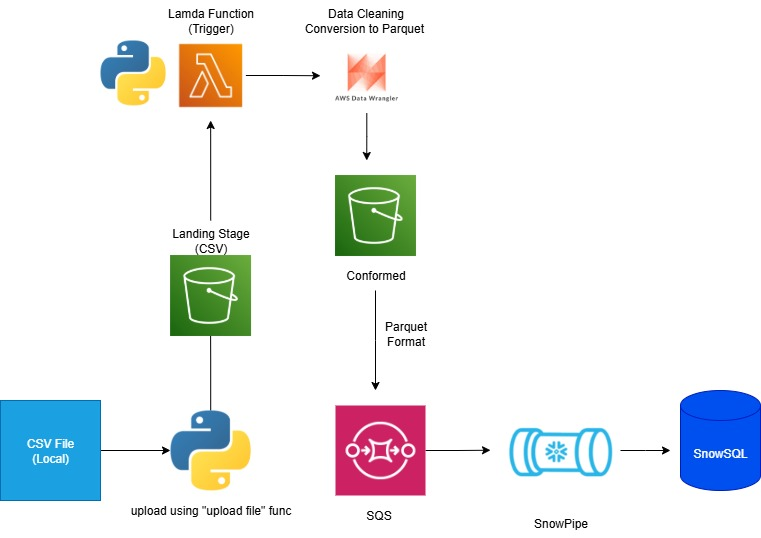

# Lab 1: Research Activity
## Introduction

**Objective**: Analyze and understand the differences between various methods of uploading and downloading files using the Boto3 library for AWS S3. Determine the appropriate use cases for each method.

#### Analysis Table:

| **Method**         | **Purpose**                                                                 | **Best Use Cases**                                                                 | **Pros**                                                                                   | **Cons**                                                                                   |
|--------------------|------------------------------------------------------------------------------|-------------------------------------------------------------------------------------|---------------------------------------------------------------------------------------------|---------------------------------------------------------------------------------------------|
| `upload_file`      | Upload a file from local disk to S3.                                         | Large file uploads, backups, ETL pipelines.                                         | - Handles multipart uploads automatically - Built-in retry logic - Simple API         | - Requires file path - No progress tracking - Synchronous                            |
| `upload_fileobj`   | Upload a file-like object (e.g., stream, buffer) to S3.                      | In-memory uploads, web apps, serverless functions.                                 | - No disk I/O - Flexible input - Good for dynamic content                            | - No automatic multipart support - No progress tracking - Synchronous                |
| `put_object`       | Upload raw bytes or small files directly to S3.                              | Small files, metadata uploads, quick object creation.                              | - Simple and fast - Supports metadata and ACLs - Good for small payloads              | - No multipart support - Not ideal for large files - No retry logic                  |
| `download_file`    | Download a file from S3 to local disk.                                       | Large file downloads, backups, data ingestion.                                     | - Handles multipart downloads - Built-in retry logic - Simple API                    | - Requires local path - No progress tracking - Synchronous                           |
| `download_fileobj` | Download an S3 object into a file-like object (e.g., stream, buffer).        | In-memory processing, serverless apps, web apps.                                   | - No disk I/O - Flexible output - Good for dynamic or real-time processing            | - No automatic multipart support - No progress tracking - Synchronous                |
| `get_object`       | Retrieve an object from S3 and return metadata and body as a response dict. | Reading metadata, streaming content, partial reads.                                | - Access to metadata - Supports range requests - Good for streaming or partial reads | - Not ideal for large files - Manual handling of content - No automatic retries      |

#### Reflection Questions
**Upload Methods**:
  - What are the key differences between `upload_file`, `upload_fileobj`, and `put_object`?
    - upload_file is best for uploading large files from disk with automatic multipart support and retries. upload_fileobj is ideal for uploading in-memory or streamed data using file-like objects. put_object is suited for small, raw data uploads like strings or bytes, offering more control but lacking multipart and retry features.
  - When would you choose to use `put_object` over `upload_file` or `upload_fileobj`?
    -  You’d choose put_object when uploading small payloads directly from memory and don’t need the overhead of multipart handling or file management.

**Download Methods**:
  - How does `download_file` differ from `download_fileobj` and `get_object`?
    - download_file, download_fileobj, and get_object are all used to retrieve data from Amazon S3, but they differ in how they handle the output and what use cases they support. download_file is a high-level method that       downloads an object from S3 directly to a local file path. It’s best for large files and includes automatic multipart handling and retry logic, making it suitable for backups or data ingestion workflows.                  download_fileobj downloads an S3 object into a file-like object, such as a stream or buffer. This is useful when you want to process the data in memory without writing to disk, such as in serverless functions or          web applications. get_object is a lower-level method that retrieves the object and returns its metadata and body as part of a response dictionary. It’s ideal for reading metadata, streaming content, or performing         partial reads, but it doesn’t handle multipart downloads or retries automatically
  - In what scenarios would `get_object` be more beneficial than `download_file`?
    - get_object is more beneficial than download_file in scenarios where you need to access the object's metadata, stream its content, or perform partial reads directly in memory. On the other hand, download_file is           better for downloading large files directly to disk with built-in multipart handling and retry logic, but it doesn’t expose metadata or allow in-memory access.

  **Efficiency and Performance**:
  - How do multipart uploads and downloads enhance the performance of file transfer operations?
    - Multipart uploads and downloads enhance performance by splitting large files into smaller parts that are transferred in parallel. This reduces transfer time, improves reliability by allowing retries for                   individual parts, and enables resuming interrupted transfers without restarting the entire process. It's especially beneficial for large files or unstable network conditions.
  - What are the limitations of using `put_object` and `get_object` for large files?
    - put_object and get_object are not optimized for large files because they lack automatic multipart handling and retry logic. This means large transfers are more prone to failure, slower, and harder to resume if            interrupted. For large files, high-level methods like upload_file and download_file are more efficient and reliable.
    
**Practical Applications**:
- Consider a scenario where you need to upload a large video file to S3. Which method would you use and why?
  -  To upload a large video file to S3, you should use upload_file. It automatically handles multipart uploads, which improves performance and reliability for large files, and includes built-in retry logic to ensure          successful transfer even in unstable network conditions.
- If you need to process data in memory before saving it locally, which download method would be most suitable?
  - If you need to process data in memory before saving it locally, download_fileobj is the most suitable method. It allows you to download an S3 object directly into a file-like object

**Flow Diagram**

